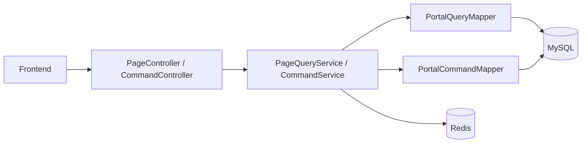

# 技术设计: 武大树洞后端实现

## 技术方案
### 核心技术
- Java 17
- Spring Boot 3.3
- Spring Web / Validation / Cache / Redis
- MyBatis + MySQL
- Maven 多模块

### 实现要点
- 使用页面聚合型接口，减少前端一次页面加载的接口数量。
- 查询接口使用 Redis 缓存热点页面结果，写操作统一驱逐缓存。
- 数据库使用演示用户与种子数据初始化，便于本地启动即用。

## 架构设计


## 架构决策 ADR
### ADR-001: 采用多模块页面聚合式后端结构
**上下文:** 当前项目只有前端页面，后端从零开始建设，需要兼顾易部署、可扩展和对接效率。  
**决策:** 将后端拆为 `common/domain/infra/server` 四个模块，并以页面聚合接口作为第一版 API 形态。  
**理由:** 多模块能把通用能力、接口契约、持久层和启动层拆开；页面聚合接口更贴合现有前端结构，联调成本更低。  
**替代方案:** 单模块分层实现 → 拒绝原因: 初期简单但后续扩展和部署边界不清晰。  
**影响:** 服务端将承担一定聚合职责，但能显著降低前端改造复杂度。

## API设计
### GET /api/v1/pages/home
- **请求:** `topic?` `keyword?`
- **响应:** 首页统计、话题预览、热榜、公告、帖子列表

### GET /api/v1/pages/topics
- **请求:** `scope=ALL|CAMPUS|ALUMNI`
- **响应:** 话题卡片和热榜

### GET /api/v1/pages/alumni
- **请求:** `topic?` `keyword?`
- **响应:** 校友故事、人脉联系人、校友圈帖子

### GET /api/v1/pages/profile
- **请求:** `conversationCode?`
- **响应:** 个人资料、我的帖子、收藏、消息会话

### POST /api/v1/posts
- **请求:** 标题、正文、话题、发布范围、是否匿名
- **响应:** 新帖子卡片

### POST /api/v1/posts/{postCode}/likes/toggle
- **请求:** 路径参数
- **响应:** 点赞状态与最新计数

### POST /api/v1/posts/{postCode}/saves/toggle
- **请求:** 路径参数
- **响应:** 收藏状态与最新计数

### POST /api/v1/alumni/contacts/{contactCode}/follow/toggle
- **请求:** 路径参数
- **响应:** 关注状态

### POST /api/v1/conversations/{conversationCode}/messages
- **请求:** 消息文本
- **响应:** 新消息体

## 数据模型
```sql
users
posts
post_interactions
topics
topic_tags
topic_rankings
notices
alumni_stories
alumni_contacts
user_follow_contacts
user_badges
user_profile_stats
conversations
messages
```

## 安全与性能
- **安全:** 所有写接口执行基础参数校验；SQL 全部使用 MyBatis 参数绑定；不在代码中硬编码生产密钥。
- **性能:** 热门页面使用 Redis 缓存；帖子和会话按时间倒序读取；互动表使用唯一索引防止重复记录。

## 测试与部署
- **测试:** 通过 Maven 编译验证模块依赖与代码结构；启动时用本地 profile 自动初始化数据库。
- **部署:** 生成单独的 `whu-treehole-server` 可执行 Jar，结合 MySQL 和 Redis 即可部署。
