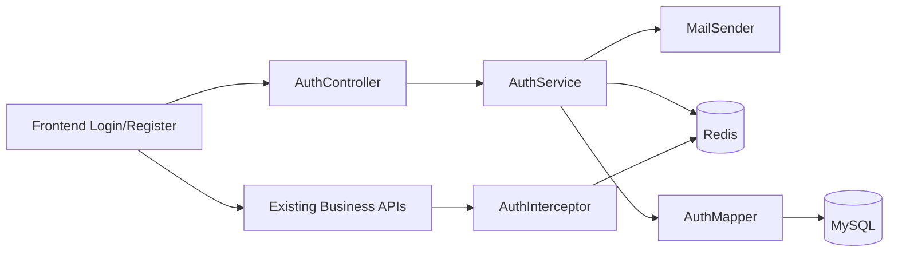

# 技术设计: 武大教育邮箱注册与账号登录

## 技术方案

### 核心技术
- Java 17
- Spring Boot 3.3
- Spring Web / Validation / Redis / Mail
- MyBatis + MySQL
- React + React Router

### 方案选择
- 邮箱限制: 仅允许 `@whu.edu.cn`
- 验证码: 6 位数字，存 Redis，默认 5 分钟过期
- 登录态: 使用随机 Bearer Token，服务端把 token -> userId/session 存 Redis
- 密码存储: `BCryptPasswordEncoder`

选择这个方案的原因:
- 相比 JWT，随机 token + Redis 更贴合当前项目已有 Redis 依赖，撤销登录态也更直接。
- 相比把验证码落库，Redis 更适合短时验证码和限流计数。
- 相比继续用邮箱登录，用户名密码更符合用户提出的后续登录要求。

## 架构设计

## 数据设计

### 新增或调整的数据表
- `users`
  - 扩展账号基础字段: `email`, `username`, `auth_status`
  - 保留现有展示资料字段，兼容页面展示
- `user_credentials`
  - 存储 `user_id`、`username`、`password_hash`、`email_verified_at`、`last_login_at`

说明:
- 选择保留 `users` 作为资料主表，再新增 `user_credentials` 存认证信息，避免业务资料和登录凭证强耦合。
- 邮箱验证码与登录 token 不落 MySQL，统一放 Redis。

### Redis Key 设计
- `auth:email-code:{email}`: 邮箱验证码，TTL 5 分钟
- `auth:email-send-lock:{email}`: 发送冷却锁，TTL 60 秒
- `auth:session:{token}`: 登录会话，TTL 7 天

## API 设计

### POST /api/v1/auth/email-code
- 请求: `email`
- 校验:
  - 邮箱非空
  - 必须以 `@whu.edu.cn` 结尾
  - 未超过发送冷却时间
- 响应: 发送结果

### POST /api/v1/auth/register
- 请求: `email`、`code`、`username`、`password`
- 校验:
  - 邮箱验证码正确且未过期
  - 用户名未被占用
  - 邮箱未被注册
- 动作:
  - 创建 `users`
  - 创建 `user_credentials`
  - 删除验证码
  - 直接签发登录 token

### POST /api/v1/auth/login
- 请求: `username`、`password`
- 校验:
  - 用户名存在
  - 密码匹配
- 响应:
  - `token`
  - 当前用户基础信息

### GET /api/v1/auth/me
- 需要登录
- 返回当前登录用户资料摘要

### POST /api/v1/auth/logout
- 需要登录
- 删除 Redis 会话

## 关键实现点

### 后端
1. 新增 `AuthController`、`AuthService`、`AuthInterceptor`、`AuthContextHolder`
2. 新增 `AuthMapper` 与对应 XML
3. 所有现有控制器从 `DemoUserContext` 切换到 `AuthContextHolder`
4. `WebConfig` 注册拦截器，并放行 `/api/v1/auth/**`
5. `application.yml` 增加 mail 和 auth 会话配置

### 前端
1. 新增登录页、注册页
2. 新增认证上下文，负责 token 持久化、恢复登录、退出登录
3. API 客户端自动附加 `Authorization` 请求头
4. 未登录用户访问现有页面时自动跳转登录页

## 安全与性能
- 所有密码使用 BCrypt 散列，不明文入库。
- 验证码带 TTL 与冷却锁，避免频繁轰炸邮箱。
- 会话 token 使用高随机字符串，服务端集中失效控制。
- 认证失败统一返回业务异常，避免泄露过多账号状态信息。

## 验证计划
- Maven 测试与启动验证通过
- 前端构建通过
- 手工验证:
  - 非 `@whu.edu.cn` 邮箱发送验证码失败
  - 正确邮箱可发送验证码
  - 错误验证码无法注册
  - 正确验证码注册成功并自动登录
  - 用户名密码可再次登录
  - 登录后发帖记录写入当前用户
