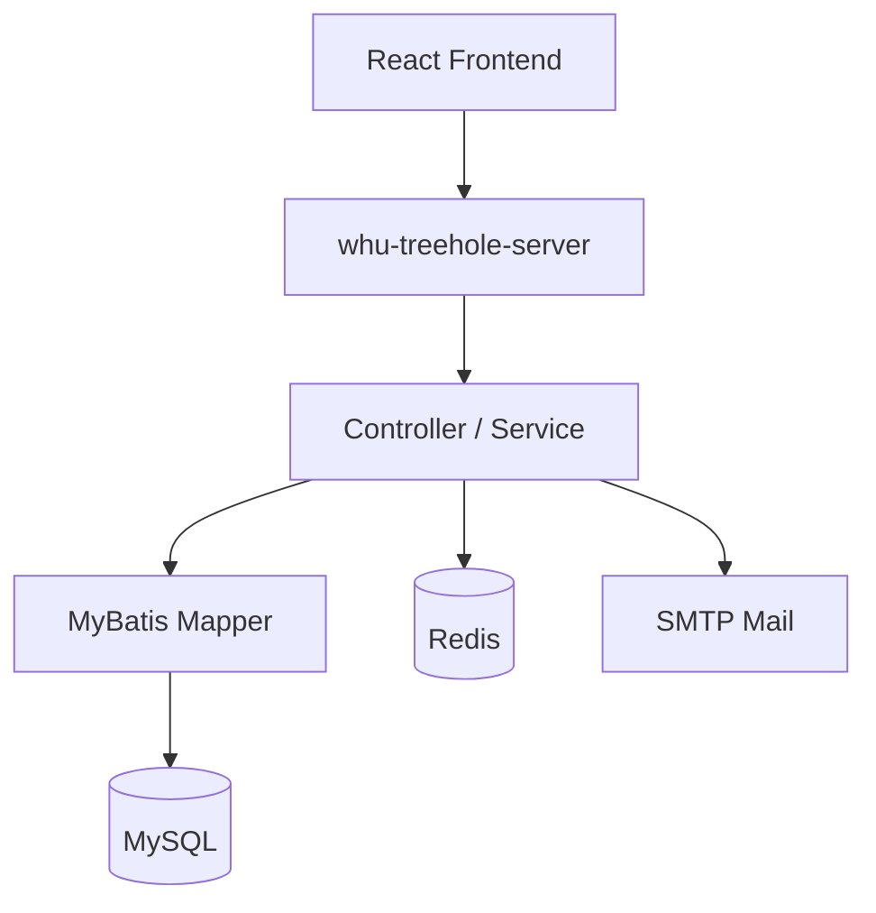
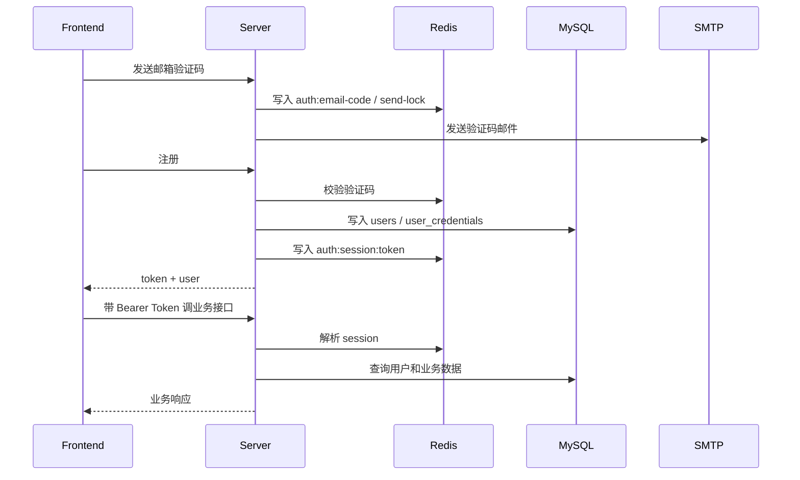

# 架构设计

## 总体架构

```mermaid
flowchart TD
    A[React Frontend] --> B[whu-treehole-server]
    B --> C[Controller / Service]
    C --> D[MyBatis Mapper]
    D --> E[(MySQL)]
    C --> F[(Redis)]
    C --> G[SMTP Mail]
```

## 关键链路

```mermaid
sequenceDiagram
    participant Client as Frontend
    participant API as Server
    participant Redis as Redis
    participant DB as MySQL
    participant Mail as SMTP

    Client->>API: 发送邮箱验证码
    API->>Redis: 写入 auth:email-code / send-lock
    API->>Mail: 发送验证码邮件

    Client->>API: 注册
    API->>Redis: 校验验证码
    API->>DB: 写入 users / user_credentials
    API->>Redis: 写入 auth:session:token
    API-->>Client: token + user

    Client->>API: 带 Bearer Token 调业务接口
    API->>Redis: 解析 session
    API->>DB: 查询用户和业务数据
    API-->>Client: 业务响应
```

## 架构决策
- ADR-001: 使用 Maven 多模块结构拆分 common/domain/infra/server。
- ADR-002: 使用 Redis Bearer Token 会话，而不是直接把登录态放在前端本地判断。
- ADR-003: 首次注册要求武大教育邮箱验证码，后续登录只使用用户名和密码。
