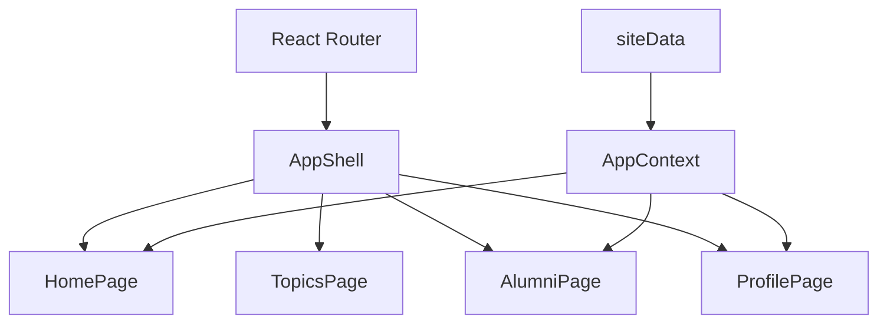

# 技术设计: 武大树洞 React 化重构

## 技术方案
### 核心技术
- React
- TypeScript
- Vite
- React Router
- 原生 CSS 变量

### 实现要点
- 使用 `AppShell` 管理导航、页脚、移动端入口与发布弹层
- 使用 `AppContext` 维护帖子、收藏、关注、消息会话等跨页面状态
- 使用统一的 `PostCard`、`Icon` 和共享数据模型复用四个页面
- 用路由参数与查询参数承接话题筛选和页面跳转

## 架构设计


## 架构决策 ADR
### ADR-20260408-01: 将分散静态页整合为 React SPA
**上下文:** 现有页面互相独立，无法共享导航、状态与组件，扩展交互成本很高。  
**决策:** 采用 React + Vite 构建单页应用，通过 React Router 承载四个主页面，并用 Context 管理本地状态。  
**理由:** 能在不引入后端的前提下快速建立规范结构，同时保留后续扩展到 API 的空间。  
**替代方案:** 保持多 HTML 页面并补脚本联动 → 拒绝原因: 页面重复高、无法形成可维护的组件体系。  
**影响:** 目录结构会明显变化，原有三个独立 HTML 页面将被移除并迁入 `src/pages/`。

## API设计
当前版本无外部 API，页面交互通过本地状态方法完成。

## 数据模型
```sql
FeedPost(id, title, content, author, handle, topic, audience, likes, comments, saves, image)
TopicCard(id, name, description, heat, tags)
Conversation(id, name, lastMessage, unreadCount)
Message(id, sender, text, time)
```

## 安全与性能
- **安全:** 不引入真实身份信息与密钥；本地状态只写入浏览器本地存储
- **性能:** 共享卡片组件和静态种子数据，避免重复加载与重复渲染结构

## 测试与部署
- **测试:** 通过 `npm install` 安装依赖后执行 `npm run build` 做构建验证
- **部署:** 当前仅输出标准 Vite 项目结构，可继续接入静态托管平台
