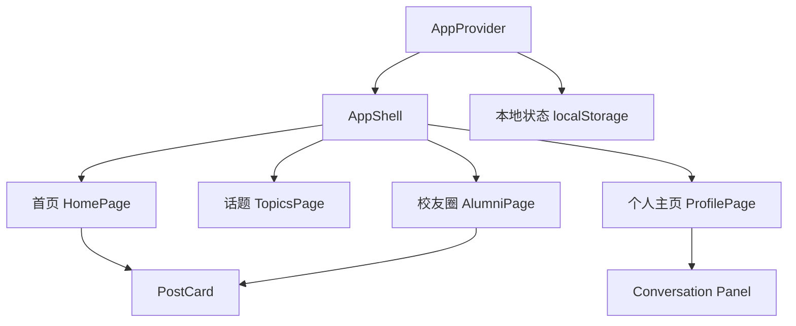
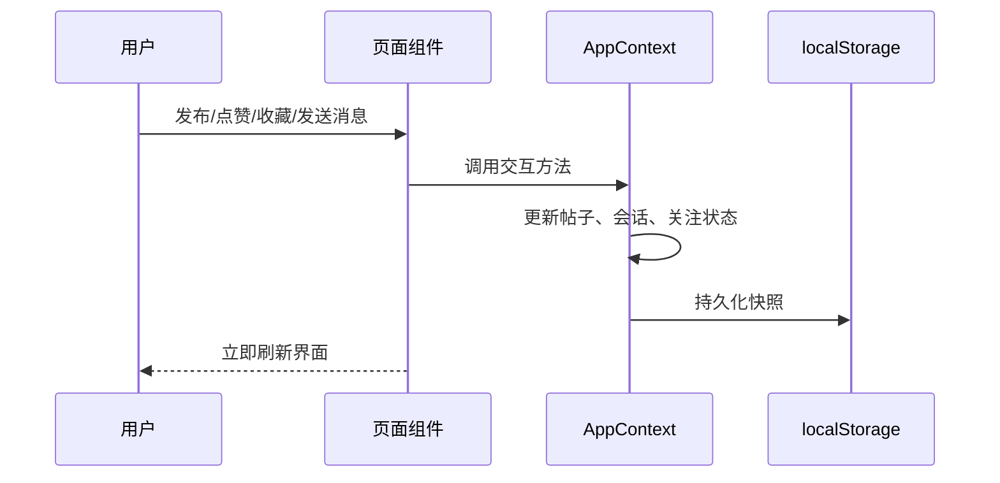

# 架构设计

## 总体架构

## 技术栈
- **前端:** React + TypeScript + Vite
- **路由:** React Router
- **数据:** 本地内存状态 + `localStorage`

## 核心流程

## 重大架构决策
完整的ADR存储在各变更的 how.md 中，本章节提供索引。

| adr_id | title | date | status | affected_modules | details |
|--------|-------|------|--------|------------------|---------|
| ADR-20260408-01 | 将分散静态页整合为 React SPA | 2026-04-08 | ✅已采纳 | app-shell, home-feed, topic-explorer, alumni-circle, profile-center | [history/2026-04/202604081846_whu_treehole_react/how.md#adr-20260408-01-将分散静态页整合为-react-spa](../history/2026-04/202604081846_whu_treehole_react/how.md#adr-20260408-01-%E5%B0%86%E5%88%86%E6%95%A3%E9%9D%99%E6%80%81%E9%A1%B5%E6%95%B4%E5%90%88%E4%B8%BA-react-spa) |
