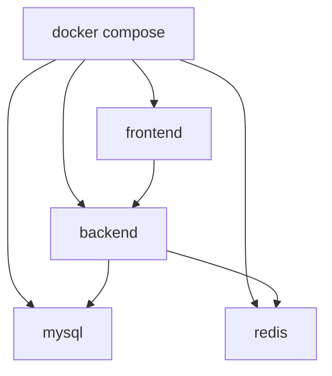

# 技术设计: 远程服务器 Docker 一键部署

## 技术方案
### 核心技术
- Docker / Docker Compose
- Nginx
- Spring Boot 环境变量绑定

### 实现要点
- 为前端提供多阶段构建 Dockerfile，并用 Nginx 统一托管静态资源与 API 代理。
- 为后端提供多阶段 Maven 构建 Dockerfile，运行时仅保留 JRE 和可执行 Jar。
- 在 Compose 中编排 MySQL、Redis、backend、frontend，使用环境变量控制凭据与运行模式。

## 架构设计


## 架构决策 ADR
### ADR-20260409-01: 使用 Nginx 统一承载前端静态资源与 API 代理
**上下文:** 前端默认使用 `/api/v1`，Vite 本地开发代理不能直接用于远程服务器部署。
**决策:** 在前端生产镜像中使用 Nginx 承载静态资源，并将 `/api/v1` 代理到 backend 容器。
**理由:** 这样可以保留前端默认相对路径调用，减少跨域与环境分支判断。
**替代方案:** 前端直接写死远程 API 域名 → 拒绝原因: 环境切换成本高，且不利于同域部署。
**影响:** 需要新增 Nginx 配置文件，并保证前端容器依赖 backend 服务。

### ADR-20260409-02: 使用环境变量替代仓库中的容器运行敏感配置
**上下文:** 当前后端配置中存在数据库、Redis 和 SMTP 的硬编码配置，不适合远程部署。
**决策:** 将 MySQL、Redis、SMTP 和 SQL 初始化模式改为环境变量注入，Compose 提供默认值或覆盖入口。
**理由:** 减少仓库中的敏感信息暴露，且更适合远程服务器、测试和生产环境切换。
**替代方案:** 在仓库内维护单独的生产配置文件 → 拒绝原因: 仍会引入敏感信息落库和环境漂移问题。
**影响:** 需要更新 `application.yml` 与 `.env.example`，并确保 Compose 传递完整变量。

## API设计
### [ANY] /api/v1/**
- **请求:** 浏览器到前端 Nginx 的同域请求
- **响应:** 前端代理到后端后的原始 JSON

### [GET] /actuator/health
- **请求:** 前端或运维检查服务状态
- **响应:** 后端 Spring Actuator 健康信息

## 数据模型
```sql
-- MySQL 首次启动时由 docker/se_project.sql 初始化
-- Spring Boot 容器内通过环境变量控制 spring.sql.init.mode=never
```

## 安全与性能
- **安全:** 仓库中不再保留可直接使用的数据库、Redis、SMTP 凭据；前端仅暴露一个公网入口，后端服务默认不暴露公网端口。
- **性能:** 前端使用多阶段构建减小镜像体积；后端运行镜像仅保留 JRE 与最终 Jar；通过 `.dockerignore` 缩小构建上下文。

## 测试与部署
- **测试:** 执行前端 `npm run build` 与后端 `mvn -q -s settings.xml -pl whu-treehole-server -am test`。
- **部署:** 服务器安装 Docker 后，在仓库根目录执行 `docker compose up -d --build`；如需自定义密码或 SMTP，先复制 `.env.example` 为 `.env` 并填写。
