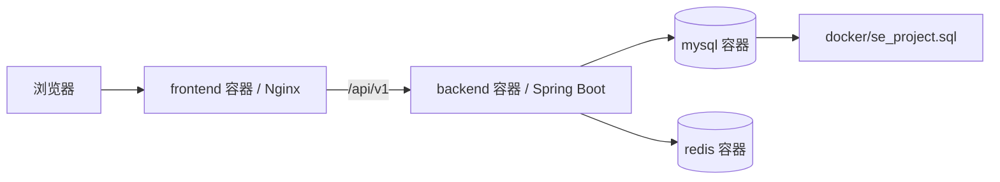
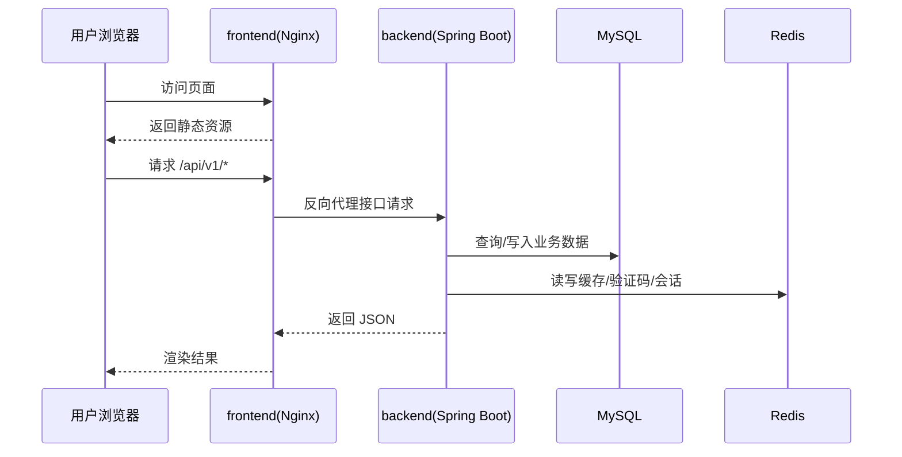

# 架构设计

## 总体架构

## 技术栈
- **后端:** Java 17 / Spring Boot / Maven / MyBatis
- **前端:** React / Vite / Nginx
- **数据:** MySQL 8 / Redis 7
- **部署:** Docker Compose

## 核心流程

## 重大架构决策
完整的 ADR 存储在各变更的 how.md 中，本章节提供索引。

| adr_id | title | date | status | affected_modules | details |
|--------|-------|------|--------|------------------|---------|
| ADR-20260409-01 | 使用 Nginx 统一承载前端静态资源与 API 代理 | 2026-04-09 | ✅已采纳 | frontend,deployment | [../history/2026-04/202604091701_remote_docker_deploy/how.md#adr-20260409-01-使用-nginx-统一承载前端静态资源与-api-代理](../history/2026-04/202604091701_remote_docker_deploy/how.md#adr-20260409-01-使用-nginx-统一承载前端静态资源与-api-代理) |
| ADR-20260409-02 | 使用环境变量替代仓库中的容器运行敏感配置 | 2026-04-09 | ✅已采纳 | backend,deployment | [../history/2026-04/202604091701_remote_docker_deploy/how.md#adr-20260409-02-使用环境变量替代仓库中的容器运行敏感配置](../history/2026-04/202604091701_remote_docker_deploy/how.md#adr-20260409-02-使用环境变量替代仓库中的容器运行敏感配置) |
